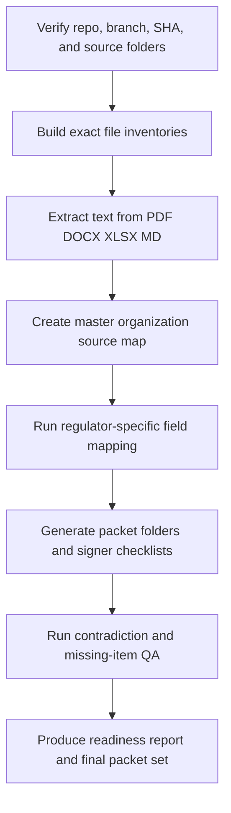

# CI-ION Master Source Map and Packet Orchestration Research Report

## Executive Summary

The repository and branch you identified are real and publicly visible. The branch `module-10-17-source-first-dry-run-review` contains the committed source bundle at `CNA-Recert-Course/CI-ION Rosurce for Form Applications`, and the referenced commit `ded72dcdaaf9f875a0ac7fc5bbb12c65addb01d1` shows **60 files changed** with the message **“Add CI-ION form application resources.”** The same branch also contains the three packet work areas you flagged: `_CNA_Recert`, `_RCFE CETP`, and `_BRN CEP Care Manager CE Application - Optional`. citeturn24view0turn7view0turn8view0turn8view1

The highest-confidence operational conclusion is that CI Institute of Nursing should be treated as having an already-approved **online NATP** track, but **NATP approval is not the same thing as CE provider approval**. CDPH’s forms list separates the online NATP application/renewal forms from the CDPH continuing-education provider applications, and CI Institute of Nursing appears on CDPH’s approved online NATP list. That means the existing NATP file set is valuable as **source evidence for entity, sites, instructors, and governance**, but it does **not** eliminate the need to complete the separate CE approval packet(s). citeturn25search0turn26search1turn17search3turn19search6

The most important regulatory conflict is on the CNA side. CDPH requires a CNA to complete **48 hours over a two-year certification period**, with **at least 12 hours in each year**, and allows **no more than 24 of those 48 hours via CDPH-approved online CE**. At the same time, the public `_CNA_Recert` binder in the repo still frames the project as a **12-hour asynchronous online theory** packet, not a finalized 48-hour Part 1 / Part 2 renewal catalog. So the orchestration prompt must force a local check for the actual 48-hour structure and must explicitly flag any all-online “48-hour renewal” claim as a compliance risk unless the package is split into approved online and non-online hours, or otherwise reframed as a broader catalog rather than all-countable online renewal hours. citeturn29view0turn30view0turn20view0turn15view0

Among the three packet families, the **RCFE/CDSS** track is the furthest along in the repo. The RCFE vendor binder says a draft LIC 9141 exists, nine first-wave LIC 9140 course packets were drafted, and the first-wave catalog publicly visible in the branch shows nine RCFE CETP courses totaling **27 hours** and **$270** in course fees. The **BRN** folder, by contrast, explicitly labels itself **“Not Started / Optional Expansion”** and lists a large set of still-pending identity, course, instructor, certificate, flyer, policy, and payment items. citeturn14view0turn15view1turn39view0turn11view0turn13view0

The right build strategy is therefore **source-first, regulator-specific, and signer-safe**: create one canonical master source map for CI-ION’s legal/entity/contact/instructor/catalog/policy data, then generate three separate signer-review packets from that map: **CNA/CDPH**, **RCFE/CDSS**, and **BRN CEP**. Any field not proven from a local source file should stay placeholdered as `[[NOT FOUND IN REPO]]`, `[[MISSING: ...]]`, or `[[REGULATOR VERIFICATION REQUIRED]]` rather than guessed. That is particularly important because many of the most valuable files in the commit are PDFs/XLSX files that GitHub’s commit view shows only as binary artifacts, not readable content. citeturn24view1turn11view0turn13view0

### Readiness snapshot

| Packet | Current posture from official rules + repo evidence | Can the workstream start now | Should submission wait for course/LMS stability |
|---|---|---:|---:|
| CNA/CDPH 48-hour Part 1 / Part 2 | **Needs redesign / validation first.** CDPH online CE requires course list, reviewer access, identity controls, interactive feedback, timed participation, affidavit screen, and certificate logic; public repo binder still shows an internal 12-hour async theory packet. citeturn20view0turn32view0turn15view0 | Yes | **Yes** |
| RCFE/CDSS LIC 9141 + LIC 9140 family | **Most advanced.** Vendor draft exists; first-wave course family and pricing are already scaffolded; official CDSS rules allow vendor and course tracks to move in parallel, though course credit cannot be offered before approval. citeturn14view0turn21view0turn34view0turn39view0 | Yes | Vendor packet can stabilize earlier; course packets should wait until course materials are frozen |
| BRN CEP case-management | **Optional / not started.** Official BRN packet is provider-based, not course-by-course, but still requires a representative course, instructor packet, flyer/brochure, sample certificate, recordkeeping and refund/cancellation policies, and $750 fee. Repo folder lists these as pending. citeturn22view0turn22view1turn23view1turn23view2turn13view0 | Yes | **Usually yes**, until one representative course and all policy/certificate items are stable |

## Regulatory Baseline and Early Submission Reality

For **CNA renewal**, CDPH’s renewal materials are clear: a CNA renews with **CDPH 283C** and supporting **CDPH 283A** documentation; the CE must come from **CDPH-approved CE providers with a NAC#**; at least **12 hours must be completed in each of the two years**; and **no more than 24 hours** may come from a CDPH-approved online CE program. CDPH’s online CE provider application **CDPH 192B** is a separate online-provider approval form, and it requires the provider’s business information, reviewer credentials, a personal identification mechanism, interactive feedback, a printable affidavit before certificate release, a timed participation mechanism, contact information, and a record-retention system. CDPH’s applicants page also says online CE applicants submit the online provider application, course list, business license for proprietary providers, and CDPH 193 contact form, and that the packet goes by **email or fax, not mail**. citeturn29view0turn30view0turn20view0turn32view0

That means the CNA/CDPH packet can absolutely be **prepared** in parallel, but it is the packet that most strongly depends on a stable course-delivery implementation. If the intended CNA packet is **online**, the provider cannot credibly submit a signer-ready packet without a reviewer URL/login, timed participation controls, interactivity, certificate behavior, and the final affidavit flow. If the intended CNA packet is **classroom/in-person** instead, the path shifts to **CDPH 192** and requires lesson plans, sign-in sheet samples, instructor licensure, certificate samples, and a recordkeeping policy. Either way, the master source map can start immediately; submission should not. citeturn20view0turn32view0turn18view0

For **RCFE administrator CETP**, CDSS requires a **separate LIC 9141** for each program/vendor type, and a **separate LIC 9140** for each new or updated course. Training-vendor approval is for a **two-year period**. CDSS recommends submission at least **60 days** before the proposed offering, and incomplete applications trigger a notice giving the vendor **30 days** to cure missing information. For CETP vendors, the fees are **$140** for the vendor application and **$10 per unit/hour** for each new or updated CETP course. The ACB vendor guidance and course review guide add a particularly important point for your automation design: self-paced and live-stream course packets must include reviewer logins, active participation controls, participant feedback mechanics, and a final quiz/test before a certificate is issued. citeturn21view0turn34view0turn35view0turn36view0

RCFE renewal rules also shape how the course catalog should be mapped. For RCFE administrator renewal, a certificate holder generally needs **40 hours**, with **at least 20 in live format** and up to **20 in self-paced format**, including **at least four hours** in laws/regulations/policies/procedural standards and **at least eight hours** on Alzheimer’s disease or other dementias; ACB will not accept **more than 10 hours in one day**. The repo’s first-wave RCFE catalog aligns well with that structure: it includes a 4-hour laws course, two 4-hour dementia courses, and other RCFE topical courses, each mapped to a single LIC 9140. citeturn21view2turn21view3turn39view0

The RCFE track is therefore the best candidate for **true parallelization**. CDSS explicitly says a prospective CETP vendor is **highly recommended** to submit a proposed LIC 9140 course with the LIC 9141, but the course request can also be submitted later during the two-year vendor approval. In practice, that means you can run **organization-level vendor packet work** and **course-packet production** in parallel, with separate internal readiness gates. citeturn21view0turn35view0

For **BRN CEP**, the central rule is different: the BRN approves **providers, not individual courses**. The BRN application packet still requires a completed provider application, a **Course Information** form for a representative offering, an **Instructor Information** form for each instructor, a proposed flyer/brochure, a sample certificate of completion, and the **$750** fee. BRN guidance also requires four-year record retention, written refund and cancellation policies, proof-of-attendance issuance, and careful advertising language. The BRN uses **“contact hours”**, not “CEUs,” and home study / independent study offerings are permitted, with the provider expected to maintain a methodology for how contact hours are determined. citeturn22view0turn22view1turn23view0turn23view1turn23view2turn23view3turn23view4turn37view1

That makes BRN more flexible than CDPH on LMS maturity. If you are using a live, webinar, workshop, or other representative course, you can prepare most of the packet without a large finished LMS catalog. But the repo’s own BRN folder says the workstream is still optional/not started and identifies the legal applicant identity, FEIN, contact roles, instructor files, flyer, certificate, and policies as still pending. So the BRN packet can move **in parallel as a documentation project**, but it is **not signer-ready yet**. citeturn11view0turn12view0turn13view0

### Early-submission comparison

| Packet | Can be prepared early | Can be submitted early | Why |
|---|---|---|---|
| CDPH CNA online CE | Yes | Usually no | CDPH 192B expects the actual online delivery controls, reviewer access, course list, and certificate logic to exist at submission time. citeturn20view0turn32view0 |
| CDPH CNA classroom CE | Yes | Sometimes, if classroom-only packet is complete | CDPH 192 relies on lesson plans, sign-in model, instructors, certificate, and recordkeeping rather than online runtime controls. citeturn18view0turn32view0 |
| CDSS RCFE LIC 9141 vendor | Yes | Yes, once entity/signer/fee fields are frozen | CDSS allows vendor and course tracks to be separate, though courses cannot be offered until approved. citeturn21view0turn34view0 |
| CDSS RCFE LIC 9140 courses | Yes | Only once each course packet is fully stable | Each course needs its own outline, sources, instructor support, evaluation, and any self-paced/live-stream review access. citeturn35view0turn36view0 |
| BRN CEP provider | Yes | Often yes, if one representative course and required policies are complete | BRN approves providers rather than a full catalog, but still needs a complete representative course, instructors, flyer, certificate, policies, and payment. citeturn22view1turn23view1turn23view2turn37view1 |

## Repository Evidence and Source Inventory

The commit bundle is useful because it concentrates the **organization-common materials** that usually drive the hardest application fields: BPPE resource documents, approval letters, annual report materials, contacts spreadsheets, student catalog and enrollment documents, right-to-cancel materials, STRF/SPFS materials, CDPH initial application forms, ownership/disclosure forms, and instructor applications. In other words, the commit is exactly the kind of source bundle an automation agent should mine first for legal name, DBA, address, phone, website, signer history, catalog language, tuition/refund disclosures, contact roles, and instructor identity evidence. citeturn24view0turn24view1

A best-effort public tree of the most important source areas looks like this, based on the branch and commit views. citeturn24view0turn24view1turn10view2turn8view0turn8view1

```text
CNA-Recert-Course/
├─ CI-ION Rosurce for Form Applications/
│  ├─ 2. CDPH Compliance/
│  │  ├─ CDPH 2025 Data/
│  │  ├─ CDPH Resources/
│  │  └─ Letters From CDPH/
│  ├─ 3. BPPE Compliance/
│  │  ├─ BPPE Forms/
│  │  ├─ BPPE Resources/
│  │  ├─ CI-ION Contacts.xlsx
│  │  ├─ Data Compliance Templets/
│  │  ├─ Forms and Data for Compliance/
│  │  ├─ Letters and Communication from BPPE/
│  │  ├─ SPFS / STRF supporting data
│  │  └─ STRF Assessment Report Forms/
│  ├─ 4b. Supporting Documents/
│  │  ├─ Student Catalog
│  │  ├─ Enrollment Agreement
│  │  ├─ Right to Cancel
│  │  └─ On-Site Inspection Documents
│  ├─ Initial Application BPPE/
│  └─ Initial Application CDPH/
│     ├─ CDPH 276D Ownership and Disclosure
│     ├─ cdphe276
│     ├─ cdphe276p
│     └─ cdphe279 instructor applications
├─ _CNA_Recert/
│  └─ CNA-Recert-Course_CNA_Recert/
│     ├─ assets/
│     ├─ CNA_Recertification_Project_Binder.md/.pdf
│     ├─ Source Index
│     ├─ Build Report
│     ├─ Flowchart
│     └─ Executive Task Tracker
├─ _RCFE CETP/
│  ├─ RCFE CETP Vendor Packet for CDSS/
│  ├─ RCFE CETP Course Approval Applications - LIC 9140/
│  └─ RCFE CETP Vendor Packet for CDSS_ARCHIVE_COMBINED_20260603/
└─ _BRN CEP Care Manager CE Application - Optional/
   ├─ assets/
   ├─ BRN planning binder md/pdf
   ├─ forms and source links
   ├─ pending information
   ├─ research notes
   └─ task and form checklist
```

The `_CNA_Recert` folder is valuable as project context, but it is **not yet a signer-ready 48-hour CE packet**. The binder says it is an **internal execution packet**, not production-approved, and explicitly preserves a posture of **12-hour asynchronous online theory** with certificate production disabled pending approval metadata, active-time validation, approved certificate wording, affidavit method, and compliance/legal/owner clearance. That is a major mismatch against the requested 48-hour Part 1 / Part 2 packet. citeturn15view0

The `_RCFE CETP` folder is much stronger. The vendor packet’s executive summary says the internal handoff includes an official CDSS form inventory, a filled LIC 9141 draft for **New / RCFE / CETP**, LIC 9140 filled drafts and full attachment packets for **nine proposed first-wave courses**, instructor-documentation packet work, LMS/reviewer-access requirements, website/catalog claim-safety rules, and post-approval roster/schedule/certificate/recordkeeping templates. It also states that instructor documentation and LMS/reviewer access remain pending, which makes those explicit gap items rather than open-ended guesses. citeturn14view0

The visible first-wave RCFE course catalog is especially useful for packet orchestration because it already expresses the course family in a machine-mappable format: nine course IDs, titles, hours, core categories, fees, and a one-course/one-LIC-9140 rule. The nine titles are: laws/regulations/policies/procedural standards; two Alzheimer’s/dementia courses; residents’ rights/abuse prevention; medication management; admission/retention/reappraisal/needs and services plans; emergency procedures and physical environment; staff supervision/training records/accountability; and business operations/records/claim-safe communications. citeturn39view0

The BRN folder is the opposite: it is excellent as a **gap register**, but weak as a finished packet. The public `BRN_CEP_PENDING_INFORMATION.md` explicitly says that the legal applicant name, entity type, FEIN, mailing address, contact person, CE coordinator, recordkeeping custodian, record storage address, representative course, instructors, instructor credentials, flyer, and sample certificate are all still pending confirmation or not source-backed in that workstream. citeturn11view0turn11view3

One more source-governance point matters. The source bundle contains BPPE files that mention both **CI Institute of Nursing** and materials tied to **Care Indeed** email/address patterns. That may be routine corporate history, or it may signal a legal-entity / DBA / control-relationship issue. Either way, an automation agent must **not infer equivalence**. It should flag any apparent cross-entity relationship as `[[REGULATOR VERIFICATION REQUIRED]]` until proven by an approval letter, ownership document, signed application, or other authoritative local source. citeturn24view1

## Canonical Master Source Map Design

The master source map should be the single source of truth from which all three signer-review packets are generated. The table structure you specified is correct, but the practical unit of record should be **one field / one value / one source-use row**, not merely one field row. That matters because the same underlying datum often needs multiple validated variants: for example, the legal name on a regulator form, the public-facing provider name on a certificate, the website displayed in marketing, and the storage address used for recordkeeping may not be the same field, and different regulators care about different variants. That design choice is supported by the fact that CDPH, CDSS, and BRN ask for overlapping but not identical identity, contact, course, instructor, record, and public-claim fields. citeturn20view0turn22view0turn21view0

The minimum column set for `applications/00_MASTER_SOURCE_FIELD_MAP.md` should be:

| Column | Purpose |
|---|---|
| `field` | Canonical field name, e.g. `org.legal_name`, `org.dba`, `course.rcfe.core_topic`, `certificate.retention_statement` |
| `extracted_value` | Exact extracted value or placeholder |
| `source_file` | Local repo path to the authoritative file |
| `quote_or_ref` | Short snippet, cell reference, page/section, or worksheet/cell range |
| `applies_to` | `CDPH_CNA`, `CDSS_RCFE`, `BRN_CEP`, or multiple |
| `confidence` | `High`, `Medium`, `Low` |
| `signer_review_required` | `Yes` / `No` |
| `missing_action` | Concrete next step or owner handoff |

The canonical field families should be organized this way:

| Field family | Typical local source candidates | Why it matters |
|---|---|---|
| Legal entity, DBA, business type, FEIN, mailing/business/record addresses, phone, email, website | BPPE approval letters, annual report materials, contact spreadsheets, student catalog, enrollment agreement, CDPH initial application forms, signed regulator applications in the bundle. citeturn24view0turn24view1 | These fields recur across all three packets. |
| NATP approval evidence | Official CDPH approved online NATP listing, CDPH initial/renewal NATP forms in the commit bundle, CDPH letters, TVL verification evidence. citeturn25search0turn17search0turn24view1 | Proves existing regulated operating track, but is not itself CE approval. |
| Authorized signer and signer authority | Signed draft forms, ownership/disclosure records, letterhead approvals, governance materials, explicit authorized-representative pages. citeturn24view1turn22view0turn21view0 | This is one of the highest-risk areas to guess. |
| Program director, registrar, compliance lead, CE coordinator, recordkeeping custodian | Binders, task trackers, contacts spreadsheets, recordkeeping policies, application contact fields. citeturn15view0turn13view0turn24view0 | Needed for workflow ownership and several regulator fields. |
| Instructor roster, CVs, licenses, qualifications | CDPH E279s, instructor binders, resumes, license copies, BRN instructor forms, RCFE instructor packet. citeturn24view1turn10view3turn22view0 | Required by all three packets in different forms. |
| Course catalog and regulator crosswalk | RCFE course catalog and course packets, CNA lesson plans/course list, BRN representative course docs. citeturn39view0turn32view0turn22view0 | Drives hours, categories, and packet splits. |
| Objectives, timed outlines, teaching methods, assessments | LIC 9140 data, CDPH lesson plans, BRN course-information forms. citeturn36view0turn18view0turn22view0 | Central to course approval review. |
| Certificates and proof-of-attendance controls | CDPH 192/192B requirements, ACB sample certificate, BRN certificate rules, internal templates. citeturn20view0turn18view0turn36view1turn23view4 | High-risk public claim and audit area. |
| Record-retention, refund, cancellation, privacy/PHI, enrollment/catalog disclosures | BPPE catalog/right-to-cancel/enrollment docs, CDPH recordkeeping policy requirements, BRN provider policies, RCFE record lists. citeturn24view1turn18view0turn20view0turn23view1turn23view2turn36view0 | These are frequently missing even when course content is ready. |
| LMS / reviewer evidence | LMS data sheet, Moodle/SPFS website materials, reviewer-access packet, URL/login/password fields. citeturn24view0turn10view3turn20view0turn36view0 | Critical for CDPH online CE and CDSS self-paced/live-stream review. |

The placeholder and confidence rules should be strict:

| Rule | Meaning |
|---|---|
| `[[NOT FOUND IN REPO]]` | The automation agent searched the local repo and did not find any supporting source. |
| `[[MISSING: ...]]` | The field is known to be required, but the actual value or artifact is absent. |
| `[[REGULATOR VERIFICATION REQUIRED]]` | The repo suggests a value, but official instructions or cross-source inconsistency make it unsafe to finalize without human verification. |
| `High confidence` | Exact value from a signed form, approval letter, official listing, or a stable institutional source. |
| `Medium confidence` | Same value corroborated by multiple internal sources, but not yet by a signed submission artifact. |
| `Low confidence` | Planning binder or task note only; no formal evidence. |

Signer review should default to **Yes** for legal identity, DBA, FEIN/tax ID, signer name/title, signer authority, regulator/provider numbers, addresses, payment amounts, certificate wording, public approval statements, refund/cancellation language, recordkeeping location, and any field with source conflict. That is the safest posture given the mixed source set and the public evidence of still-pending items in the BRN and RCFE folders. citeturn13view0turn14view0

## Missing Items and Owner Matrix

The list below combines three kinds of missingness: items explicitly marked pending in the repo, items clearly required by regulators, and items that may exist inside local binary files but could not be verified from the public web view. Items in the last category should be treated as **unconfirmed**, not nonexistent. citeturn11view0turn13view0turn24view1

### Aggregated missing-items matrix

| Missing or unconfirmed item | Owner | Why it matters | Risk if wrong or absent | Best next action |
|---|---|---|---|---|
| Canonical legal applicant name and DBA normalization across CDPH, CDSS, BRN, and BPPE | Compliance Lead + Authorized Signer | Every packet starts with entity identity; BRN folder still shows this as pending; BPPE bundle shows multiple naming contexts. citeturn11view0turn24view1 | Rejection, returned packet, mismatch across applications | Extract from local approval letters, catalogs, signed forms; reconcile into one signer-verified answer set |
| FEIN / tax ID | Finance/Admin | Required by BRN and often appears in identity/governance records. citeturn22view0turn11view0 | Packet cannot be signed or submitted | Source from signed finance record or prior official filing; never infer |
| Authorized signer name, title, and authority evidence | Authorized Signer + Legal/Compliance | RCFE, BRN, and CDPH all rely on a responsible signatory; repo does not publicly expose a clean authority trail. citeturn22view0turn21view0turn24view1 | False attestation risk | Add board resolution, ownership proof, delegation memo, or other authority artifact to source bundle |
| Primary business address, mailing address, record-storage address, phone, email, and website | Registrar + Compliance | Required in all three tracks, but not all are publicly exposed from the repo. citeturn20view0turn22view0turn11view0 | Regulator correspondence failures, inconsistent certificates | Extract from contacts sheet, catalog, applications, and approval letters; source-lock them |
| NATP approval evidence path and NATP number evidence | Compliance Lead | Helpful common-source evidence, but distinct from CE approval. citeturn25search0turn17search3 | Misstating NATP as CE approval | Use official listing + local E276/E276R/letters; mark CE numbers separately |
| Recordkeeping custodian and record-retention location | Registrar + Compliance | Required by CDPH online CE, BRN, and RCFE course-review materials. citeturn20view0turn23view1turn36view0 | Audit failure | Build one cross-regulator recordkeeping policy and map regulator-specific wording |
| Privacy / PHI / learner-data handling policy | Legal/Privacy | Needed for LMS-delivered education and prudent for signer review; not publicly confirmed in the repo materials reviewed here. citeturn24view0turn20view0 | Weak governance posture | Add a single policy source and map it to each packet |
| Instructor master roster with CVs/licenses/resumes | Instructor Lead + Compliance | Required by CDPH, CDSS, and BRN in different forms; repo shows instructor packets pending in RCFE and BRN. citeturn18view0turn22view0turn14view0turn13view0 | Course packet incompleteness | Create one instructor ledger with source paths to licenses and CVs |
| Final certificate templates by regulator | Registrar + Compliance | All three regulators impose certificate/proof-of-completion rules; repo still shows pending wording and claim controls. citeturn20view0turn18view0turn36view1turn23view4 | Misleading certificate or invalid proof of completion | Maintain one template per regulator, not one generic certificate |
| Public claim-safe language | Compliance + Marketing | The repo itself warns not to imply approval or use issued numbers prematurely. citeturn14view0turn13view0 | False advertising | Add a mandatory “claim-safe” review block to every packet |
| CDPH path decision: classroom CE, online CE, or both | Compliance Lead | CDPH 192 and 192B require materially different evidence. citeturn18view0turn20view0turn32view0 | Wrong application family | Decide the filing path before the automation agent populates forms |
| CNA 48-hour Part 1 / Part 2 course matrix | Program Director + Compliance | Current public repo packet is still 12-hour async theory; CDPH rules cap online countable hours at 24 per renewal period. citeturn15view0turn29view0turn30view0turn20view0 | Core scope mismatch | Produce a source-backed matrix showing which hours are offered, which are online, and which are countable |
| CDPH reviewer URL, login, password, identity/PIN method, interactivity, timer, affidavit | LMS Admin | Mandatory for online CE approval. citeturn20view0turn32view0 | CDPH packet not credible | Freeze one reviewer environment and document it |
| CDPH course list and CE pricing | Program Director + Finance/Admin | CDPH 192B asks for course pricing and course list; online applicants must list all courses. citeturn20view0turn32view0 | Incomplete application | Build explicit CNA course list, hours, and pricing source |
| CDPH certificate wording with NAC# placeholder and four-year retention statement | Registrar | Required certificate elements are explicit. citeturn20view0turn18view0 | Invalid renewal support | Finalize certificate template with placeholder logic |
| CDPH 193 contact form | Registrar | Explicitly required on CDPH applicants page for online CE. citeturn32view0 | Packet incomplete | Add signer-review worksheet for CDPH 193 |
| RCFE LIC 9141 final org fields and signer fields | Compliance Lead | Vendor packet says draft exists, but not all identity/signer items are publicly confirmed. citeturn14view0turn21view0 | Vendor application delay | Populate from master org source map and route to signer |
| RCFE instructor qualification packet | Instructor Lead | Vendor binder says instructor names, resumes, and evidence remain pending. citeturn14view0 | LIC 9140 packets blocked | Build instructor-by-course assignment sheet with evidence links |
| RCFE reviewer access for any self-paced/live-stream elements | LMS Admin | CDSS requires attendance/participation evidence and reviewer access for self-paced/live-stream course review. citeturn36view0turn35view0 | Course denial or hold | Provide demo login and participation-control memo |
| RCFE final roster, quarterly schedule notification, record list, certificate | Registrar + Compliance | Vendor binder says templates exist as a handoff concept, but completion is not publicly confirmed. citeturn14view0turn34view0 | Post-approval operational gap | Generate these from the course catalog and vendor number model |
| BRN go/no-go decision on CEP track | Executive / Dee | Repo explicitly says this is an optional expansion and asks to confirm whether CI-ION wants BRN CEP approval. citeturn12view0 | Wasted effort or unsanctioned filing | Make executive decision before full packet generation |
| BRN legal applicant identity, type, FEIN, contact person, CE coordinator, record custodian, record address | Compliance + Finance/Admin + Operations | All explicitly pending in BRN repo files. citeturn11view0turn12view0 | Application cannot be completed | Map from master org source map; if absent, keep placeholders |
| BRN representative case-management course | Program Director | BRN packet needs one sample course and the public BRN folder shows it as pending. citeturn12view0turn22view0 | No viable application | Select one RN-relevant course and freeze its materials first |
| BRN objectives, overview, teaching methods, outline, contact-hour methodology, implicit-bias treatment, evaluation method | Curriculum Lead | Explicit application fields. citeturn22view0turn13view0 | Packet incomplete | Build one fully compliant representative course package |
| BRN instructor forms and evidence | Instructor Lead + Compliance | Explicitly required; repo shows this as pending. citeturn22view0turn13view0 | Packet incomplete | Prepare one separate instructor form per instructor |
| BRN flyer/brochure and sample certificate | Marketing + Compliance | Required for application packet; repo shows them pending. citeturn22view1turn23view4turn13view0 | Submission blocked | Draft from representative course and placeholder provider statement |
| BRN refund, cancellation, and recordkeeping policies | Compliance + Finance/Admin + Operations | BRN requires them in writing. citeturn23view1turn23view2turn13view0 | Submission blocked | Build one policy packet, then version it for signer review |
| BRN payment approval | Finance/Admin | The BRN fee is $750. citeturn22view0turn37view1 | Cannot submit | Prepare payment approval artifact and signer routing |

### Parallel sequencing with owners

| Sequence | Primary owner | What runs in parallel | Internal gate before submission |
|---|---|---|---|
| Source-lock wave | Compliance Lead | Inventory commit bundle and three packet folders; extract common org fields | Master org field map reviewed |
| RCFE vendor wave | Compliance Lead | LIC 9141 org/signer packet | Entity, signer, fee, and mailing details frozen |
| RCFE course wave | Curriculum + Instructor Lead + LMS Admin | Nine LIC 9140 packets can be built in parallel course by course | Each course outline, sources, instructor evidence, quiz/evaluation, and any reviewer access stable |
| CDPH design wave | Program Director + Compliance + LMS Admin | Course catalog matrix, 192 vs 192B decision, certificate model, LMS evidence | Filing path chosen and LMS/runtime evidence complete if online |
| BRN representative-course wave | Program Director + Compliance | One representative course, one instructor packet, flyer, certificate, policies | Executive go/no-go and representative course fully frozen |
| Signer wave | Authorized Signer + Dee/Executive | Separate signer-review packets for each regulator | No unresolved `[[REGULATOR VERIFICATION REQUIRED]]` items in required form fields |

## Orchestration Prompt

The prompt below is designed for a local automation agent that has direct filesystem access to the Windows repo at `C:\AI\Git\CNA_Recertification_Theory_Clinical_Support` and is allowed to create markdown outputs under `applications\`. It is intentionally source-first and conservative because the public repo view shows that many important artifacts are binary files and because the CNA/BRN tracks contain unresolved gaps. The rules encoded here reflect the official regulator requirements summarized above and the specific readiness signals visible in the repo. citeturn24view1turn20view0turn21view0turn22view1

```text
You are an automation agent running locally against the repo:
C:\AI\Git\CNA_Recertification_Theory_Clinical_Support

Goal:
Create signer-review packet work products for CI Institute of Nursing under applications\ using a source-first method.
Do not guess legal names, DBAs, signer identities, provider numbers, approval dates, certificate wording, authority evidence, FEIN, or public approval claims.
If a value is not proven by a local source, output:
- [[NOT FOUND IN REPO]]
- [[MISSING: <what is needed>]]
- [[REGULATOR VERIFICATION REQUIRED]]

Exact repo context to verify first:
- repo name: robertp-max/CNA_Recertification_Theory_Clinical_Support
- branch: module-10-17-source-first-dry-run-review
- full commit SHA: ded72dcdaaf9f875a0ac7fc5bbb12c65addb01d1
- source bundle folder: CNA-Recert-Course\CI-ION Rosurce for Form Applications
- additional packet folders:
  - CNA-Recert-Course\_CNA_Recert
  - CNA-Recert-Course\_RCFE CETP
  - CNA-Recert-Course\_BRN CEP Care Manager CE Application - Optional

Use this PowerShell verification sequence:
1)
$RepoRoot = 'C:\AI\Git\CNA_Recertification_Theory_Clinical_Support'
git -C $RepoRoot rev-parse --verify ded72dcdaaf9f875a0ac7fc5bbb12c65addb01d1
git -C $RepoRoot cat-file -t ded72dcdaaf9f875a0ac7fc5bbb12c65addb01d1
git -C $RepoRoot branch --show-current
git -C $RepoRoot checkout module-10-17-source-first-dry-run-review

2)
$AppRoot = Join-Path $RepoRoot 'applications'
New-Item -ItemType Directory -Force -Path $AppRoot | Out-Null
New-Item -ItemType Directory -Force -Path (Join-Path $AppRoot 'inventory') | Out-Null
New-Item -ItemType Directory -Force -Path (Join-Path $AppRoot 'extracted_text') | Out-Null
New-Item -ItemType Directory -Force -Path (Join-Path $AppRoot 'cna_cdph_packet') | Out-Null
New-Item -ItemType Directory -Force -Path (Join-Path $AppRoot 'rcfe_cdss_packet') | Out-Null
New-Item -ItemType Directory -Force -Path (Join-Path $AppRoot 'brn_cep_packet') | Out-Null

3) Build exact inventories
git -C $RepoRoot ls-tree -r --name-only ded72dcdaaf9f875a0ac7fc5bbb12c65addb01d1 -- "CNA-Recert-Course/CI-ION Rosurce for Form Applications" | Set-Content (Join-Path $AppRoot 'inventory\commit_ded72dc_60_files.txt')

Get-ChildItem -Recurse -File (Join-Path $RepoRoot 'CNA-Recert-Course\_CNA_Recert') |
  Select-Object FullName, Length, LastWriteTime |
  Export-Csv -NoTypeInformation (Join-Path $AppRoot 'inventory\_CNA_Recert_file_inventory.csv')

Get-ChildItem -Recurse -File (Join-Path $RepoRoot 'CNA-Recert-Course\_RCFE CETP') |
  Select-Object FullName, Length, LastWriteTime |
  Export-Csv -NoTypeInformation (Join-Path $AppRoot 'inventory\_RCFE_CETP_file_inventory.csv')

Get-ChildItem -Recurse -File (Join-Path $RepoRoot 'CNA-Recert-Course\_BRN CEP Care Manager CE Application - Optional') |
  Select-Object FullName, Length, LastWriteTime |
  Export-Csv -NoTypeInformation (Join-Path $AppRoot 'inventory\_BRN_CEP_file_inventory.csv')

4) Extract text from all local source files into applications\extracted_text\
- For .md/.txt: copy text directly.
- For .pdf: extract text page-by-page.
- For .docx: extract body text, tables, headers if present.
- For .xlsx: extract worksheet names and all non-empty cells with sheet/cell references.
- Preserve original relative path in metadata.
- For each extracted file, create a paired metadata record with:
  source_path
  file_type
  extractor_used
  extraction_timestamp

5) Source precedence rules
A. Official regulator source copied into repo or authoritative signed/issued regulator artifact
B. Signed institutional application or approval letter
C. Approved institutional catalog / enrollment / disclosure document
D. Current internal binder or packet
E. Planning notes / checklists
If sources conflict, do not resolve by guesswork:
- keep both values
- mark field [[REGULATOR VERIFICATION REQUIRED]]
- route to signer review

6) Create applications\00_MASTER_SOURCE_FIELD_MAP.md
Table columns exactly:
| field | extracted value | source file | quote/ref | applies to which regulator | confidence | signer review required | missing action |

Required field families to map:
- org.legal_name
- org.dba
- org.entity_type
- org.natp_evidence
- org.natp_number
- org.business_address
- org.mailing_address
- org.record_storage_address
- org.phone
- org.email
- org.website
- org.tax_id
- org.authorized_signer_name
- org.authorized_signer_title
- org.signer_authority_evidence
- org.program_director
- org.registrar
- org.compliance_lead
- org.recordkeeping_custodian
- org.privacy_phi_policy
- org.fee_payment_evidence
- instructor.name / title / license / expiration / CV / source reference
- course.id / course.title / hours / format / part1_part2_tag / regulator_topic_tag
- course.objectives
- course.outline
- course.teaching_methods
- course.assessment_method
- certificate.template_reference
- certificate.required_wording
- records.retention_policy
- catalog.disclosures
- enrollment.right_to_cancel
- lms.url
- lms.reviewer_login
- lms.active_time_control
- lms.identity_control
- lms.interactivity_method
- lms.final_affidavit_or_attestation
- public_claim_controls

Confidence rules:
- High = exact value found in an official or signed local source
- Medium = corroborated by 2+ local sources
- Low = only in planning material
Any signer-sensitive field defaults to signer review required = Yes.

7) Create applications\00_MASTER_READINESS_REPORT.md
Include:
- Executive summary
- Packet readiness table for CNA/CDPH, RCFE/CDSS, BRN CEP
- Early-submission vs wait-to-submit analysis
- Parallel sequencing by owner
- Critical contradictions detected
- File inventory summary

8) Create applications\00_MASTER_MISSING_ITEMS.md
Aggregate every missing or unconfirmed item across all packets.
Columns:
| packet | missing item | current status | owner | why it matters | risk | next action |
Owners must be one of:
- Program Director
- Compliance Lead
- Registrar
- Instructor
- LMS Admin
- Legal/Privacy
- Finance/Admin
- Authorized Signer

9) Build regulator-specific packet folders

A) applications\cna_cdph_packet\
Create:
- README_packet_scope.md
- signer_review_checklist.md
- missing_items.md
- source_index.md
- cna_course_matrix_part1_part2.md
- cdph_form_field_map.md
- cdph_online_readiness_or_classroom_path_decision.md

CNA/CDPH validation rules:
- Do not treat NATP approval as CE provider approval.
- Explicitly determine whether the filing path is:
  - CDPH 192 classroom/in-person CE
  - CDPH 192B online CE
  - or both
- If online CE is used, require proof/source for:
  reviewer URL
  reviewer user ID and password
  participant identity/PIN control
  interactive feedback
  final printable affidavit/attestation before certificate release
  timed active participation mechanism
  course list
  contact information form
  certificate wording
  recordkeeping policy
- Use local sources to determine whether the proposed 48-hour Part 1 / Part 2 offering is:
  a course catalog architecture
  an annual plan
  or a claimed renewal-eligible package
- If all 48 are online, explicitly flag:
  [[REGULATOR VERIFICATION REQUIRED: CNA renewal credit may not exceed 24 online hours in a two-year period]]
- Preserve Part 1 / Part 2 as an internal catalog tag, not as a regulator-defined form field unless a local form expressly uses it.

B) applications\rcfe_cdss_packet\
Create:
- README_packet_scope.md
- signer_review_checklist.md
- missing_items.md
- source_index.md
- lic9141_vendor_field_map.md
- first_wave_lic9140_course_matrix.md
- per_course_submission_index.md
- rcfe_claim_safe_language.md

RCFE/CDSS validation rules:
- Separate LIC 9141 vendor fields from LIC 9140 course fields.
- Maintain one LIC 9140 packet per course.
- Preserve the first-wave courses exactly as source-backed.
- For each LIC 9140 packet require:
  course title
  hours
  core of knowledge category
  description
  objectives
  hour-by-hour outline
  sources/works cited
  instructor assignment and resume reference
  quiz/test or evaluation method
  participant evaluation method
  records maintained and address
  location or delivery mode
- If live-stream or self-paced:
  require reviewer access credentials
  require active participation method
  require quiz/test gate before certificate issuance
- Include notes for post-approval ops:
  LIC 9140A
  LIC 9139
  LIC 9142A
  quarterly schedule notification
  certificate template

C) applications\brn_cep_packet\
Create:
- README_packet_scope.md
- signer_review_checklist.md
- missing_items.md
- source_index.md
- brn_application_field_map.md
- representative_course_packet.md
- brn_instructor_packet_index.md
- brn_policies_packet.md
- brn_flyer_and_certificate_review.md

BRN validation rules:
- BRN approves providers, not individual courses.
- Use “contact hours,” not “CEUs,” in BRN-facing documents unless quoting a source.
- Require one fully developed representative course with:
  title
  date(s) if available
  behavioral objectives
  overview/description
  type of offering
  teaching methods
  contact hour count and methodology if independent study
  content outline
  implicit bias note if applicable
  evaluation method
- Require one Instructor Information form set per instructor.
- Require:
  flyer/brochure
  sample certificate
  refund policy
  cancellation notice policy
  refund timeline policy
  recordkeeping policy
  record storage custodian/address
  payment readiness note
- Block all preapproval marketing claims.

10) Create applications\00_ORCHESTRATION_PROMPT.md
This file must contain:
- the verification commands above
- exact local folder paths
- extraction rules
- source precedence rules
- regulator-specific validation rules
- final deliverables checklist
- a mermaid flowchart of the orchestration
- a file-tree diagram
- explicit instruction: “Do not guess signer names, provider IDs, approval numbers, or certificate wording.”

11) QA checks before finalizing any packet
- No required field may be silently blank.
- Every filled value must have a source path and quote/ref.
- Every unresolved field must be tagged with one of the required placeholders.
- Any contradiction between BPPE, CDPH, CDSS, BRN, catalog, or internal binder data must be listed in both:
  00_MASTER_READINESS_REPORT.md
  00_MASTER_MISSING_ITEMS.md
- Any public-claim language must be reviewed for premature approval wording.
- Do not overwrite original repo source files.

12) Final deliverables required
- applications\00_MASTER_SOURCE_FIELD_MAP.md
- applications\00_MASTER_READINESS_REPORT.md
- applications\00_MASTER_MISSING_ITEMS.md
- applications\inventory\commit_ded72dc_60_files.txt
- applications\inventory\_CNA_Recert_file_inventory.csv
- applications\inventory\_RCFE_CETP_file_inventory.csv
- applications\inventory\_BRN_CEP_file_inventory.csv
- applications\00_ORCHESTRATION_PROMPT.md
- one signer-review checklist template
- one completed example per packet

13) Stop conditions
If the repo does not prove a field, do not improvise.
Use placeholders and route to the correct owner.
```

### Orchestration flow



## Signer Review Templates and Examples

The template below is intentionally simple. It is optimized for a signer who needs to know what is ready, what is sourced, and what still needs review.

### Reusable signer-review checklist template

| Field block | Current value | Source reference | Confidence | Signer review required | Status / action |
|---|---|---|---|---|---|
| Legal applicant name |  |  |  | Yes |  |
| DBA / public provider name |  |  |  | Yes |  |
| Entity type |  |  |  | Yes |  |
| Primary address / mailing / record-storage address |  |  |  | Yes |  |
| Phone / email / website |  |  |  | Yes |  |
| Tax ID / FEIN |  |  |  | Yes |  |
| Authorized signer name and title |  |  |  | Yes |  |
| Authority evidence |  |  |  | Yes |  |
| Program contact roles |  |  |  | Yes |  |
| Instructor packet |  |  |  | Yes |  |
| Course packet / catalog |  |  |  | Yes |  |
| Certificate template |  |  |  | Yes |  |
| Recordkeeping policy |  |  |  | Yes |  |
| Refund / cancellation / public-claim language |  |  |  | Yes |  |
| Payment / fee evidence |  |  |  | Yes |  |

### Completed example for CNA/CDPH packet

This example reflects the highest-confidence conclusions reachable from the official requirements and the public repo inspection. It is intentionally conservative. citeturn20view0turn32view0turn15view0turn29view0turn30view0

| Field block | Current value | Source reference | Confidence | Signer review required | Status / action |
|---|---|---|---|---|---|
| Filing path | `[[REGULATOR VERIFICATION REQUIRED: choose CDPH 192 classroom, CDPH 192B online, or both]]` | Official CDPH applicants page distinguishes the two paths. citeturn32view0 | Medium | Yes | Compliance to choose before form drafting |
| Existing NATP evidence | CI Institute of Nursing appears on official approved online NATP list | Official CDPH online NATP listing. citeturn25search0turn26search1 | High | Yes | Use as source evidence only; do not treat as CE approval |
| CE provider NAC# | `[[NOT FOUND IN PUBLICLY VIEWABLE REPO]]` | Publicly reviewed sources did not expose an existing CE-provider NAC#. citeturn24view1turn30view0 | Low | Yes | Extract from local CE provider documents if already approved |
| 48-hour Part 1 / Part 2 matrix | `[[MISSING: source-backed matrix showing offered hours, online hours, and countable renewal hours]]` | Public `_CNA_Recert` binder still shows 12-hour async theory. citeturn15view0 | High | Yes | Program Director + Compliance to rebuild matrix |
| Online-hours claim | `[[REGULATOR VERIFICATION REQUIRED]]` | CNAs may apply only up to 24 online hours toward one two-year renewal period. citeturn29view0turn30view0turn20view0 | High | Yes | Add claim-safe language and learner disclosure |
| Reviewer URL / login / timer / interactivity / affidavit | `[[MISSING: complete online-runtime evidence set]]` | Required by CDPH 192B. citeturn20view0 | High | Yes | LMS Admin to freeze reviewer environment |
| Certificate template | `[[MISSING: final CDPH certificate with NAC# placeholder and retention statement]]` | Required by CDPH CE rules. citeturn20view0turn18view0 | High | Yes | Registrar to finalize template |

### Completed example for RCFE/CDSS packet

This example reflects the strongest packet family in the repo and should be the first one operationalized. citeturn14view0turn39view0turn35view0turn36view0

| Field block | Current value | Source reference | Confidence | Signer review required | Status / action |
|---|---|---|---|---|---|
| Vendor type | RCFE CETP | RCFE vendor binder executive summary and CDSS vendor rules. citeturn14view0turn21view0 | High | Yes | Ready for field mapping |
| Vendor fee | $140 | Official CDSS vendor fee schedule. citeturn34view0turn21view0 | High | Yes | Finance/Admin to attach payment proof |
| First-wave course count | 9 proposed courses | Visible RCFE course catalog and binder summary. citeturn15view1turn39view0 | High | No | Build one LIC 9140 packet per course |
| First-wave hours | 27 hours | Visible RCFE course catalog and binder summary. citeturn15view1turn39view0 | High | No | Preserve as source-backed catalog |
| Catalog structure | Laws, dementia, rights, medication, admission/retention, environment, supervision, business ops | Visible course catalog. citeturn39view0 | High | No | Good basis for per-course packets |
| Instructor packet | `[[MISSING: names, resumes, qualification evidence, disclosures]]` | Vendor binder says instructor documentation remains pending. citeturn14view0 | High | Yes | Instructor Lead to complete roster |
| LMS / reviewer access | `[[MISSING: reviewer URL, credentials, demo access, account validation]]` | Vendor binder says reviewer access remains pending; CDSS self-paced/live-stream review requires it. citeturn14view0turn36view0 | High | Yes | LMS Admin to finalize only if such formats are included |
| Certificate/roster/schedule ops | `[[MISSING: finalized post-approval operational packet]]` | Vendor binder says these are part of the intended turnover, but public completion is not confirmed. citeturn14view0turn34view0 | Medium | Yes | Registrar to finalize after vendor/source lock |

### Completed example for BRN CEP packet

This example should be treated as a controlled documentation build, not a near-term signer packet. citeturn11view0turn12view0turn13view0turn22view1

| Field block | Current value | Source reference | Confidence | Signer review required | Status / action |
|---|---|---|---|---|---|
| Track scope | `[[REGULATOR VERIFICATION REQUIRED: optional expansion / executive decision needed]]` | BRN task checklist explicitly asks whether CI-ION wants BRN CEP approval. citeturn12view0 | High | Yes | Executive decision first |
| Provider/business name | `[[PENDING CONFIRMATION]]` | Explicitly marked pending in BRN folder. citeturn11view0turn13view0 | High | Yes | Pull from master org source map |
| Entity type / FEIN / contact person | `[[PENDING CONFIRMATION]]` | Explicitly marked pending in BRN folder; required by BRN application. citeturn11view0turn22view0 | High | Yes | Finance/Admin + Compliance |
| Representative course | `[[PENDING CONFIRMATION]]` | BRN workstream says representative course selection is still pending. citeturn12view0 | High | Yes | Program Director to select one case-management course |
| Instructor packet | `[[PENDING CONFIRMATION]]` | Instructor identification and evidence still pending in BRN checklist. citeturn12view0turn13view0 | High | Yes | Instructor Lead to complete forms |
| Flyer / certificate | `[[PENDING CONFIRMATION]]` | Explicitly pending; required by BRN instructions. citeturn11view0turn22view1turn23view4 | High | Yes | Marketing + Compliance |
| Policies | `[[MISSING: refund, cancellation, refund timeline, recordkeeping]]` | Explicitly called out in BRN checklist and official BRN provider-policy guidance. citeturn13view0turn23view1turn23view2 | High | Yes | Compliance + Finance/Admin + Operations |
| Payment | $750 fee, `[[PAYMENT APPROVAL PENDING]]` | Official BRN application/checklist. citeturn22view0turn37view1 | High | Yes | Finance/Admin |

## Open Questions and Limitations

This report is high-confidence on **regulatory requirements**, **the existence and structure of the repo source areas**, and the **publicly visible readiness signals** inside the branch. It is not a substitute for local extraction of the binary files in the commit bundle. GitHub’s public commit and tree views do not expose the contents of many of the most important PDFs and spreadsheets, so some fields are correctly marked as **unconfirmed** rather than missing. citeturn24view1

The biggest open question is the **actual intended CNA filing model**. If the goal is an online CNA CE provider packet, the 48-hour Part 1 / Part 2 concept must be reconciled with CDPH’s 24-online-hour cap for any one CNA renewal cycle. If the intent is a mixed classroom + online catalog, the packet can be designed around that, but the source map and marketing language must make the distinction explicit. citeturn29view0turn30view0turn20view0

The second open question is **entity/signer normalization**. The BPPE source bundle appears rich enough to solve this locally, but based on the public inspection alone, there is still enough ambiguity around legal name, DBA, tax ID, signer authority, and possibly related entities that the automation agent should never auto-fill those fields without direct local proof. citeturn24view1turn11view0